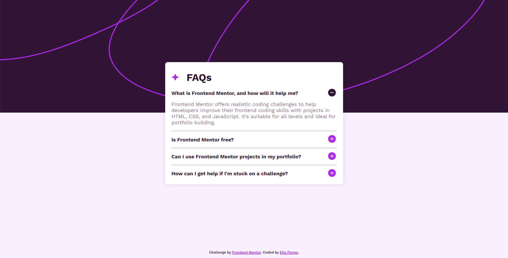

# Frontend Mentor - FAQ accordion solution

This is a solution to the [FAQ accordion challenge on Frontend Mentor](https://www.frontendmentor.io/challenges/faq-accordion-wyfFdeBwBz). Frontend Mentor challenges help you improve your coding skills by building realistic projects. 

## Table of contents

- [Overview](#overview)
  - [The challenge](#the-challenge)
  - [Screenshot](#screenshot)
  - [Links](#links)
- [My process](#my-process)
  - [Built with](#built-with)
  - [What I learned](#what-i-learned)
  - [Continued development](#continued-development)
  - [Useful resources](#useful-resources)
- [Author](#author)
- [Acknowledgments](#acknowledgments)

## Overview

### The challenge

Users should be able to:

- Hide/Show the answer to a question when the question is clicked
- Navigate the questions and hide/show answers using keyboard navigation alone
- View the optimal layout for the interface depending on their device's screen size
- See hover and focus states for all interactive elements on the page

### Screenshot

### Links

- Solution URL: [https://github.com/elioflo/faq-accordion-main](https://github.com/elioflo/faq-accordion-main)
- Live Site URL: [https://elioflo.github.io/faq-accordion-main/](https://elioflo.github.io/faq-accordion-main/)

## My process

### Built with

- Semantic HTML5 markup
- CSS custom properties
- CSS Grid
- Mobile-first workflow

### Useful resources

- [web.dev](https://web.dev/learn/html/details) - Details and summary.
- [w3schools](https://www.w3schools.com/tags/tag_details.asp) - Read about html tag `details`.
- [w3schools](https://www.w3schools.com/tags/tag_summary.asp) - Read about html tag `summary`.

## Author

- Frontend Mentor - [@elioflo](https://www.frontendmentor.io/profile/elioflo)
- Twitter - [@7532elioflo](https://twitter.com/7532elioflo)

## Acknowledgments

Discover how the very useful `details` and `summary` tags work, and where to use them.